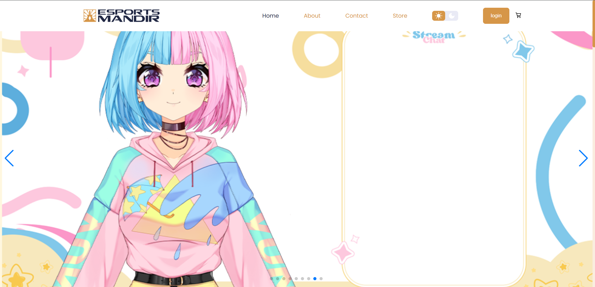
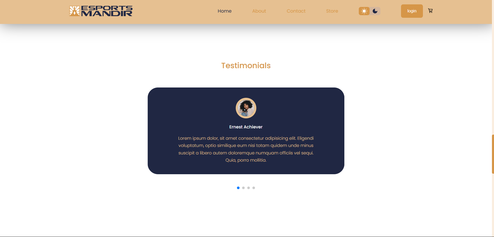
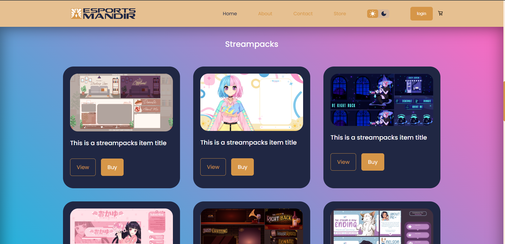

# 🛒 Esports Mandir – E-commerce Frontend UI (Showcase)

A sleek, responsive e-commerce frontend concept built with React, designed for an online electronics store.  
🔗 **Live Demo:** [esports-mandir-live.netlify.app](https://esports-mandir-live.netlify.app/)

> ⚠️ This repository contains **only media & documentation** for showcase purposes.  
> The source code is private and not available for cloning, reuse, or redistribution.

---

Responsive e-commerce frontend concept built with React. Showcase of UI/UX design for an online electronics store. Source code private – demo only.
## 📸 Preview

| Hero Section | Testimonial Section | Product Section | Contact Me |
|--------------|---------------------|-----------------|------------|
|  |  |  |  |

---

## ✨ Highlights

- Fully responsive design for desktop & mobile
- Product listing & detailed view (frontend)
- Shopping cart UI functionality
- Light/Dark theme toggle
- Modern, clean UI with smooth transitions
- Built with modular React components

---

## 🧠 Tech Stack

- **React**
- **CSS Modules / SCSS**
- **React Hooks**
- **React Router**
- **Responsive Design**

---

## 📄 License

All rights reserved.  
This project is **not open-source**. Please do not copy, redistribute, or modify without explicit permission.

---

## 🙋‍♂️ Author

**Mohit Mehtre**  
📍 [GitHub Profile](https://github.com/mohitmehtre)
